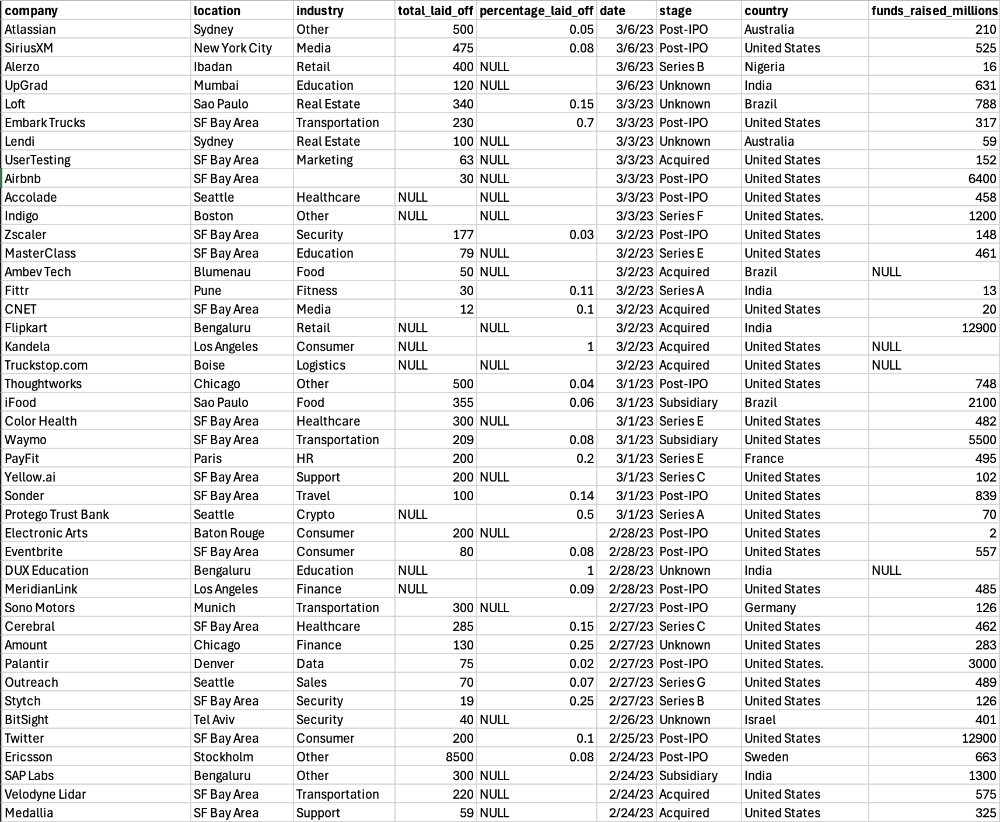
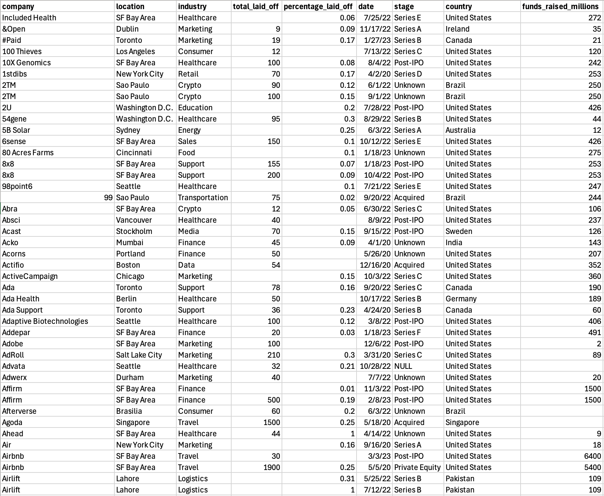

<h1 aling="center">World Layoffs Data Cleaning in MySQL 📊</h1>
<p align = "center">
  
</p>

This project is a deep dive into data cleaning using MySQL. The goal was to take a raw, messy dataset about company layoffs and transform it into a clean, standardized, and analysis-ready format. The entire process is documented in the `Data_Cleaning_Project.sql` script.

<p align="center">
  
</p>

-----

## 🧹 Data Cleaning & Transformation Steps

The raw dataset (`layoffs.csv`) had several issues, including duplicates, inconsistent naming, null values, and incorrect data types. The following steps were executed to clean the data:

### 1\. Duplicate Removal

  * **Staged Data**: A copy of the raw data was created in a new table, `layoffs_staging`, to ensure the original data remained untouched. 
  * **Duplicate Identification**: A **Common Table Expression (CTE)** and the `ROW_NUMBER()` window function were used to identify duplicate rows. A `row_num` was assigned to each row, partitioned by all columns to find identical records. 
  * **Deletion**: A second staging table, `layoffs_staging2`, was created to hold the data along with the `row_num`. Duplicates (where `row_num > 1`) were then deleted from this table. This multi-step process was used to circumvent MySQL's restriction on deleting from CTEs directly. 

### 2\. Data Standardization

This step focused on correcting inconsistencies across several columns to ensure uniformity:

  * **Whitespace Removal**: Used the `TRIM()` function to remove leading and trailing spaces from the `company` names. 
  * **Industry Consolidation**: Standardized the `industry` column by grouping similar values.  For example, 'Crypto Currency' and 'CryptoCurrency' were updated to a single 'Crypto' category. 
  * **Country Name Correction**: Cleaned the `country` column by removing trailing periods (e.g., 'United States.' became 'United States'). 
  * **Date Conversion**: The `date` column, originally stored as text in `MM/DD/YYYY` format, was converted to MySQL's standard `DATE` type using `STR_TO_DATE()`. 

### 3\. Handling Null & Blank Values

  * **Converted Blanks to Nulls**: Empty strings (`''`) in the `industry` column were updated to `NULL` to make them easier to work with. 
  * **Populated Missing Industries**: For rows with `NULL` industry values, I performed a **self-join** on the `layoffs_staging2` table. This allowed me to intelligently populate the missing `industry` for a company based on other records for that same company that had a non-null industry value. 

### 4\. Removing Unnecessary Data

  * **Removed Irrelevant Rows**: Rows where both `total_laid_off` and `percentage_laid_off` were `NULL` were deleted, as they provided little value for analysis. 
  * **Dropped Helper Column**: The temporary `row_num` column, used for duplicate detection, was dropped from the final cleaned table.

<p align="center">
  
</p>

-----

## 🛠️ Tools Used

  * **MySQL Server**: The database environment for storing and processing the data.
  * **MySQL Workbench / SQL Client**: For writing and executing the data cleaning queries.
  
  <a href="https://www.mysql.com/products/workbench/" target="_blank">
      
  </a>
  
-----

## 🚀 How To Use

1.  **Clone the repository**:
    ```sh
    git clone https://github.com/your-username/your-repository-name.git
    ```
2.  **Set up the Database**:
      * Create a database (e.g., `world_layoffs`).
      * Use the `CREATE TABLE` syntax from the start of the `.sql` file to create the initial `layoffs` table.
3.  **Import the Raw Data**:
      * Load the `layoffs.csv` file into the `layoffs` table you created.
4.  **Run the Cleaning Script**:
      * Execute the `Data_Cleaning_Project.sql` script. It will create the `layoffs_staging2` table, which contains the fully cleaned data ready for analysis.
